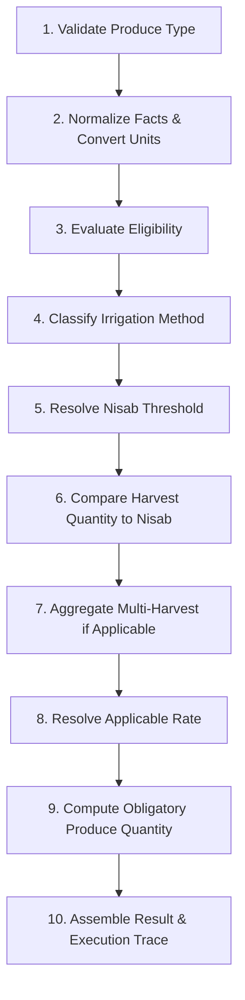

# MIZAN Agriculture Zakat Engine Specification (Phase 10)

## Architecture Overview

The MIZAN Agriculture Zakat Engine provides a deterministic, versioned, scholar-governed calculation pipeline for agricultural produce Zakat.

### 10-Step Deterministic Calculation Pipeline

## Key Principles

1. **ExactFraction Arithmetic**: All rates (1/10 rain-fed, 1/20 irrigated) and quantities are stored and computed as exact fractions (`{ numerator: bigint, denominator: bigint }`). Floating-point numbers are prohibited.
2. **Obligation in Produce Weight**: Obligation is expressed in produce weight/volume (e.g. Wasq / kg of Wheat), not as monetary currency.
3. **No Hawl Required**: Agriculture Zakat is due at harvest time (Surah Al-An'am 6:141).
4. **Synthetic Fixtures**: All Nisab, rate, and aggregation policy records are tagged `TEST_ONLY_FIXTURE`.
